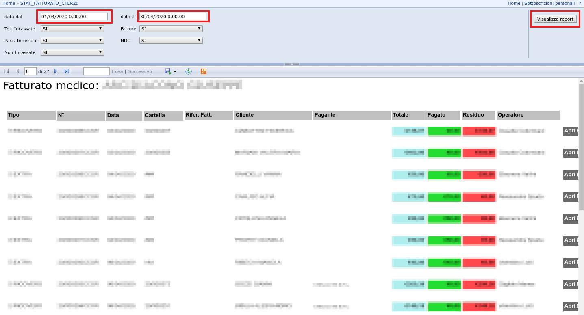

# Manuale operativo `fattureSanRossore.exe`

L’utility `fattureSanRossore` ha come unico obiettivo quello di scaricare automaticamente le fatture emesse dalla Casa di Cura San Rossore per conto di un medico.

Per utilizzarla è necessario essere in possesso di un file xls (Microsoft Excel) generato e scaricato dal portale `STAT_FATTURATO_CTERZI` raggiungibile qui:

[https://report.casadicurasanrossore.it:8443/Reports/Pages/Folder.aspx](https://report.casadicurasanrossore.it:8443/Reports/Pages/Folder.aspx).

Ecco in dettaglio la procedura da seguire

## 1. Download del report in formato `xls`

Al termine di questa procedura avremo a disposizione il report in formato `xls` delle fatture emesse dalla Casa di Cura San Rossore per conto terzi. Il report verrà poi utilizzato nella fase seguente per il download delle fatture.

1. Aprire l’indirizzo del portale di generazione del report:

   ​	[https://report.casadicurasanrossore.it:8443/Reports/Pages/Folder.aspx](https://report.casadicurasanrossore.it:8443/Reports/Pages/Folder.aspx)

2. Effettuare il login con le credenziali del medico accreditato

3. Nella pagina fare click su `STAT_FATTURATO_CTERZI` per aprire la procedura di generazione dei report

   

4. Modificare le date nei campi `data dal` e `data al` in modo che rispecchino il periodo di interesse

5. Fare click sul pulsante `Visualizza report` presente nella parte alta della pagina, sulla destra

   

6. Fare click sul pulsante raffigurante l’icona di salvataggio

7. Selezionare l’opzione `Excel` nel menù a tendina

   

8. Salvare il file in una posizione nota

## 2. Avvio della utility e download delle fatture

1. Avviare la utility facendo doppio click sull’eseguibile `fattureSanRossore-win-0.1.exe`

2. Nella finestra di dialogo selezionare il report in formato `xls` generato nella fase precedente

   

3. Attendere il completamento dei download

   

4. Nella finestra di dialogo selezionare la cartella e dare un nome al file `pdf` che conterrà le fatture scaricate

   

5. Si aprirà automaticamente il lettore pdf con il file generato

